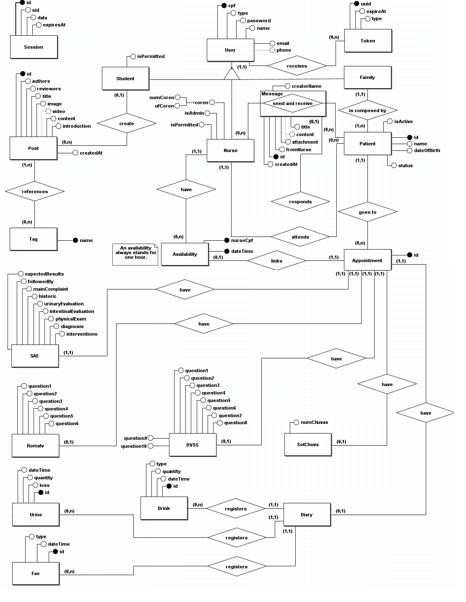

# Diagrama conceitual

## Versão: 2.0

> 

## Mudanças

### Versão 1.0

- Criado o diagrama conceitual

### Versão 2.0

- Modificado a relação entre "Message" e "Family" para "Message" e "Patient"
- Adicionado UK para "Nurse" (numCoren e ufCoren)
- Modificado cardinalidade de "Nurse" para "Availability" para 0,n
- PK de "Availability" alterada para (nurseCpf e dateTime) com nurseCpf sendo FK de "Nurse"
  - O motivo dessa mudança é que um enfermeiro deve ter sua disponibilidade alocada em uma consulta, com a modelagem antiga uma consulta alocaria essa disponibilidade para todos os enfermeiros.
- Adicionadas as tabelas "SAE", "DVSS", "RomaIv", "SolChuva", "Diary", "Drink", "Urine" e "Fae". Esses são os intrumentos de uma consulta.
